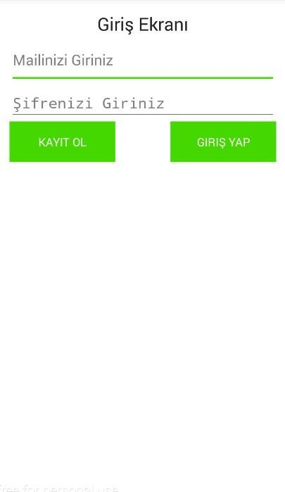
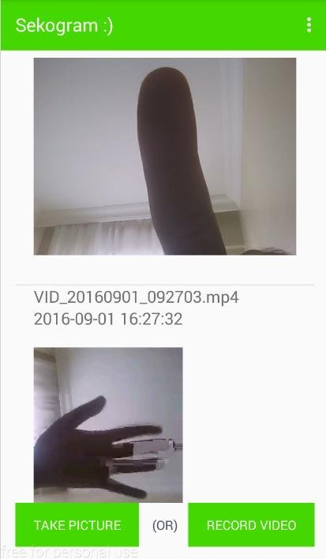
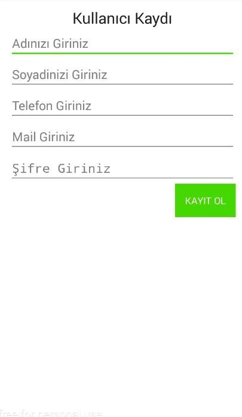

# Android Sekogram :)
Projede json teknolojileri kullanılmıştır.

Bu proje android tarafında json ile basit bir Instagram uygulamasının işlevini yapmayı hedeflemektedir.
	Üyelik Sistemini
	Fotoğraf Çekme Özelliği
	Video Çekme özelliği
	Çekilen video ve fotoğrafları upload özelliği
	Listelenen Videoların otomatik Oynatılması Özelliklerini içermektedir.	
	

